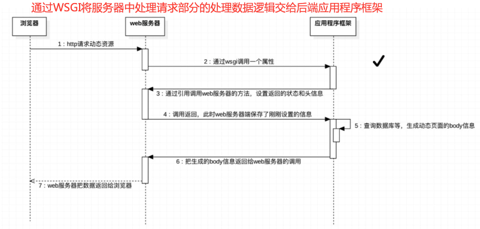

# 项目意义

- 理解socket通信
- 理解WSGI协议
- 理解前端、服务器和后端应用的关系
- web框架搭建初步基础

# 项目要点

- 基于python3.6语言编写
- 通过python内置包编写
- 此项目通过`mini_web.py`来实现web服务器基本功能，模拟Apache、Nginx、Lighttpd等这些常见的静态服务器响应web静态文件请求。
- 通过`Application.py`来构建web应用功能，模拟后端web框架等响应web动态请求。其中符合WSGI协议的服务器调用函数`app`由用户通过命令行启动时指定。本项目默认app函数。
- 本mini_web服务器启动方式：进入项目根目录:默认终端命令`python mini_web.py  8888 Application:app`来执行启动。用户可自定义一个与Application类似功能并满足WSGI协议的python包或者python文件，执行命令为:`python mini_web.py 服务器端口号 应用框架名:应用名`。
- 此项目默认URL以`.py`结尾的为动态文件进行演示。其他视为静态文件，由服务器进行请求响应。

# 技术要点

- web应用本质:
  - 1.浏览器发送一个HTTP请求；
  - 2.服务器收到请求，生成一个HTML文档；
  - 3.服务器把HTML文档作为HTTP响应的Body发送给浏览器；
  - 4.浏览器收到HTTP响应，从HTTP Body取出HTML文档并显示。
- 最简单的web应用:先把HTML用文件保存好，用一个现成的HTTP服务器软件，接收用户请求，从文件中读取HTML，返回。例如静态服务器Apache、Nginx、Lighttpd，常常将网站一些常用的css、js、image等不会经常改变的文件放置于此，让用户可以快速访问。
- 动态文件请求：一般例如用户头像、信息等数据由静态服务器转发给后端应用，并根据动态请求具体内容，进行后端模板、数据库交互组装完成动态文件，并返回给静态服务器，由静态服务器交给浏览器，并最终显示给用户。这样做的目的就是更好的业务解耦——开发人员各司其职；服务器承载负担分解，减轻压力；相同网页结构只开发一次，减轻开发压力；满足用户个性化页面显示等。
- WSGI协议:Web Server Gateway Interface
- 满足WSGI协议的动态请求过程:



- WSGI协议应用仅需要应用开发者实现一个函数来响应HTTP请求。例如:

```python
def application(environ, start_response):
    start_response('200 OK', [('Content-Type', 'text/html')])
    return '<h1>Hello, web!</h1>'
```

```
该application函数便是一个符合WSGI标准的应用函数：
它接收两个参数environ、start_response.
environ:是一个包含所有HTTP请求信息的dict对象，由web服务器提供给后端应用。
start_response：一个由服务器提供的发送HTTP响应的函数，其第一个参数为请求响应状态码，第二个参数为其他发送给浏览器的响应头。
该application函数返回响应体等。
那么我们在application.py里只需要专注于解析environ这个字典类型对象，拿到合适的HTTP请求信息，
然后根据请求构造合适的动态HTML返回给服务器，并根据请求信息，告诉服务器回复浏览器何种响应头。
```

- WSGI协议的服务器首先应当应当实现web服务器最基本的功能：

  - 服务器端TCP通信建立、

  - 与浏览器的通信——请求响应、

  - 动静态请求的识别、

  - 动态资源请求转发给后端应用、

  - 静态资源请求读取并返回给浏览器。

- WSGI协议的服务器其次应当实现WSGI协议：
  - 在处理动态请求时，调用后端应用，并传给后端应用一个字典类型参数（里面包含请求信息）
  - 包含一个后端应用从WSGI服务器处引用的发送HTTP响应的函数
  - 接收后端应用的返回内容并根据网站默认设置组装后返回给浏览器。
- 本项目的服务器还需实现的功能:
  - 从终端启动命令中解析服务器端口号、应用框架名、应用名，并将其与实际应用对应并装载。
- 除此之外，本项目通过前端框架Bootstrap-4.0.0编写服务器测试文件，采用Bootstrap3.3.0编写动态资源模板文件。

# 技术细节

- 服务器启动：
  - 解析出命令信息，并根据其导入应用框架和应用`__import__`和`getattr`
- 服务器类基本功能实现：
  - 初始化功能`__init__`
    - 创建服务器端套接字、绑定端口、监听设置等一系列操作`socket`
  - 永久启动功能`run_forvever`
    - 接收客户端请求后通过协程来建立调用浏览器请求处理措施
  - 浏览器请求处理`deal_with_request`
    - 接收请求数据并根据HTTP报文`\r\n`等请求头特点解析出请求路径信息
    - 解析请求路径正则分解出除域名外的其他信息
    - 根据信息判断是否为动态资源请求(本项目以`.py`结尾视为动态资源来演示)
    - 若为静态资源
      - 根据信息，判断读取相应的静态文件并返回给浏览器
      - 若不存在该文件，则返回ERROR
    - 若为动态资源
      - 调用后端应用，并将一个字典类型参数（请求信息）传递给后端应用
    - 所有操作响应后均立即关闭客户端套接字，以短连接socket操作。（也可以长连接套接字操作）
  - 后端应用引用的响应函数功能`start_response`
    - 网站默认设置
    - 请求头组装


- 应用端设计：
  - 应用接口函数`app`
    - 设置响应状态和指定的请求头信息，并调用服务器响应函数
    - 判断动态请求信息，调用合适的业务处理函数，完成后端应用处理。
  - 业务处理函数`index`、`center`
    - 处理并调用相应的信息返回给`app`
- 其他：
  - `localhost:8888` 默认显示PWS正常运行信息
  - `localhost:8888/grand.html`调用一个手风琴样式的风景网页来演示静态资源请求
  - `localhost:8888/index.html`也可实现静态资源请求，显示PWS正常运行页面
  - `localhost:8888/index.py localhost:8888/center.py `调用一个股票收藏的页面来演示动态资源请求。